Visual Recognition Workshop
========

Lab 1 : Using Visual Recognition with UI
========

Objective
---------

This lab will teach you how to build an image classifier using IBM's Visual Recognition service which uses machine learning to determine what is contained in the image. In these labs, we will
train Watson to detect that a customer's pizza is messed up (e.g. burned, toppings pushed to one side, cheese stuck to the box, etc.) versus a pizza that isn't. You could imagine a Pizzeria using this for
automatically sending a new pizza to customers that complained about a pizza delivery for example.

The first part of this lab will show you how to create a Visual Recognition Service, and use its tooling to test Watson provided models.

## Create an IBM Cloud Account

Go to IBM Cloud site on https://console.bluemix.net and click on **Create a free account**

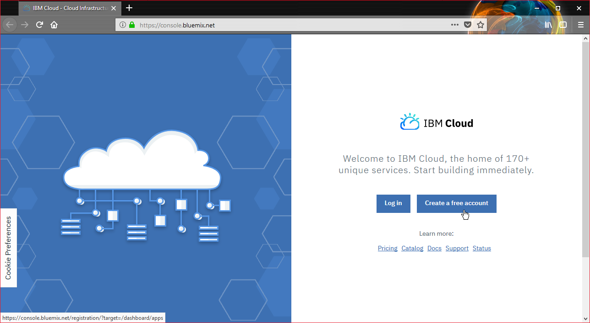

On the next screen, enter your email (or alias), Last Name, First Name and Password.

> **IMPORTANT** : Specify `United States` as country to be able to use beta features of IBM Cloud.

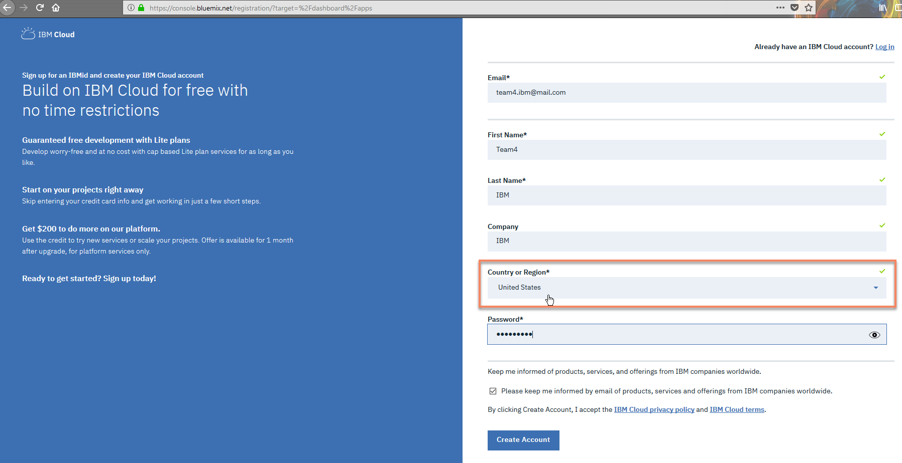

Then click on  `Create Account` 

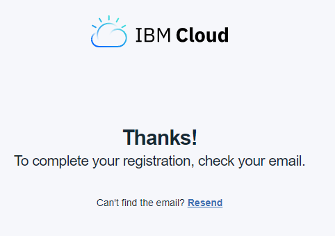

A confirmation email should be sent shortly, entitled `Action required: Confirm your IBM Cloud account`. Follow the instructions in this message to validate your account on IBM Cloud.

After having confirmed the creation of the account, proceed to login 

Create the service on the IBM Cloud
===================================

1. Login to the IBM Cloud : https://cloud.ibm.com

2. Go to the IBM Cloud **Catalog** and select **AI** category.

    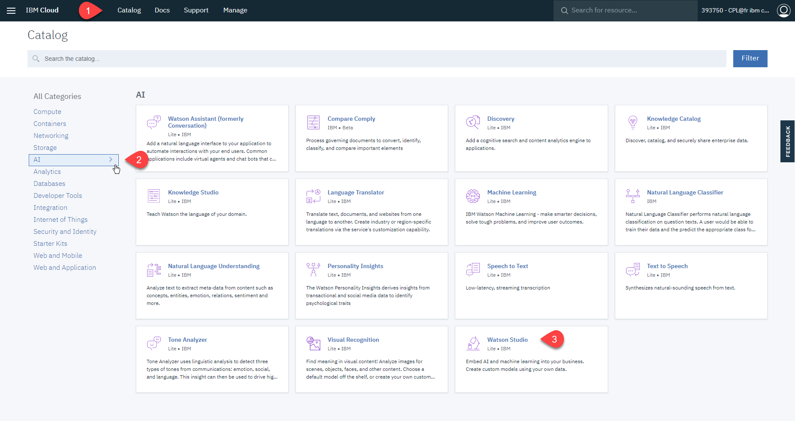

3. Then click the **Watson Studio** tile, then choose a name for your service (e.g. Watson Studio-pizza), then click the **Create** button.

    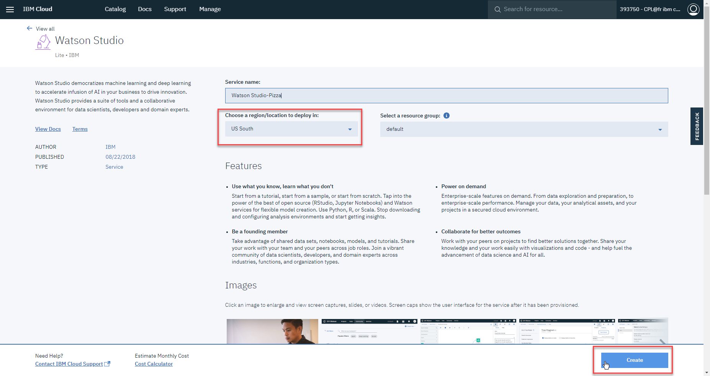

    - **IBM Watson Studio** is the tool for building AI models in a collaborative fashion so you can provide a more democratic training process that reduces AI biases.

        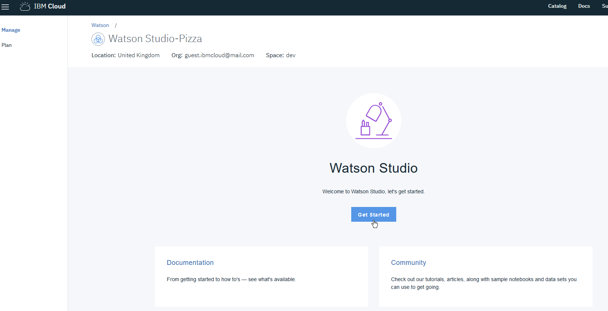

4. Click the **Get Started** button to open **Watson Studio**.

5. Click on **Continue** to select existing Organization and Space. **Select a region where you have created your IBM Cloud Account.**

  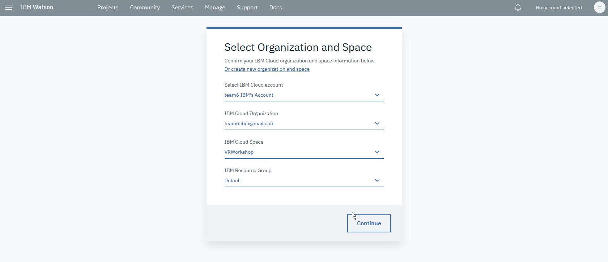

  If you have the following screen, please **contact an instructor** to get a "feature code" to be able to create a space in US South region.

  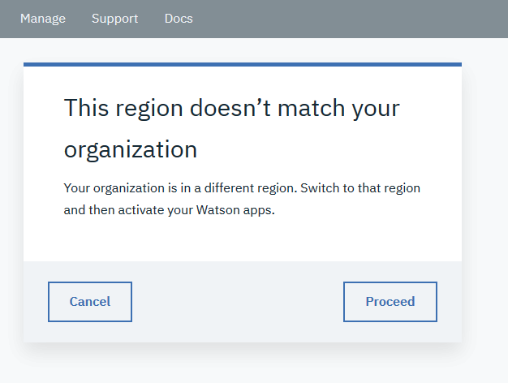

6. Click on **Get Started** to access your activated Watson Studio account

  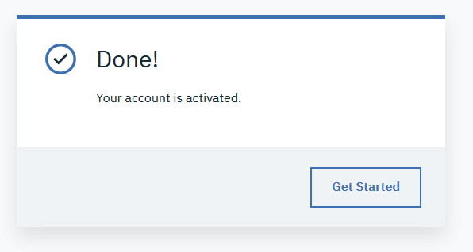

7. You can follow the Watson Studio introduction, and when ready, click the **Create project** tile to begin this new custom image recognition model.

    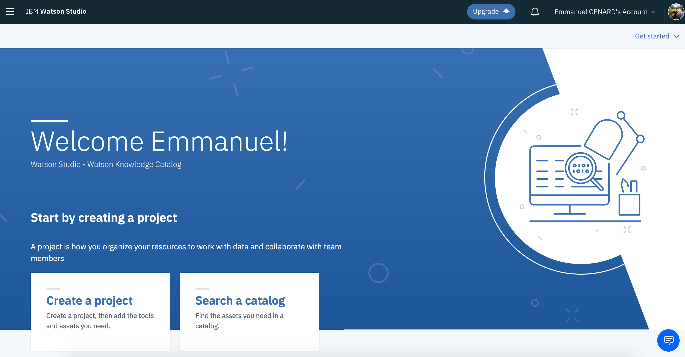

8. Choose the **Create an empty project** template and click **OK**.

    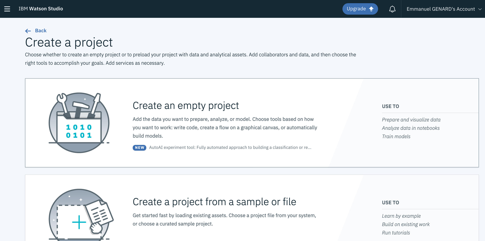

9. Enter a name for your project (e.g. My Pizza Quality Check) and a description if you like then click the **Create** button.

  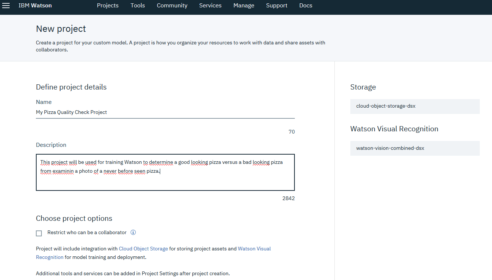

  -   Once the project is created, you need to attach a **Watson Visual Recognition** service to the project.

10. Navigate to the **Settings** tab of your project and scroll to the **Associate Services** section. On the right-hand side **Add a Watson Service** as shown in the screenshot.

  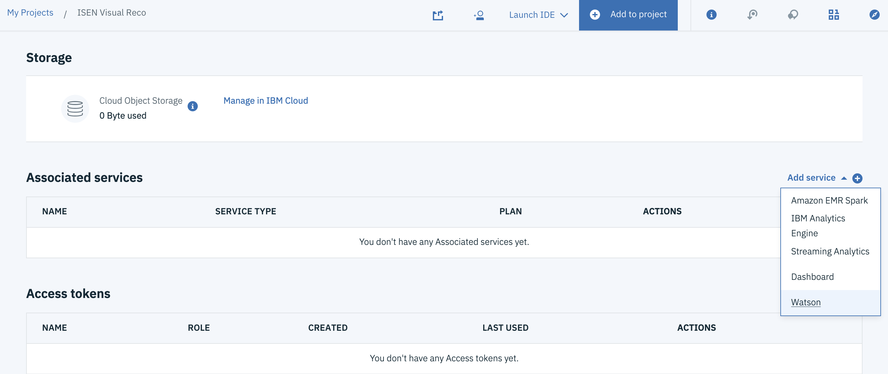

Add a new **Watson Visual Recognition** service clicking the `Add` link and configure the service to use the same geo as the one used for the **Watson Studio** service.  

  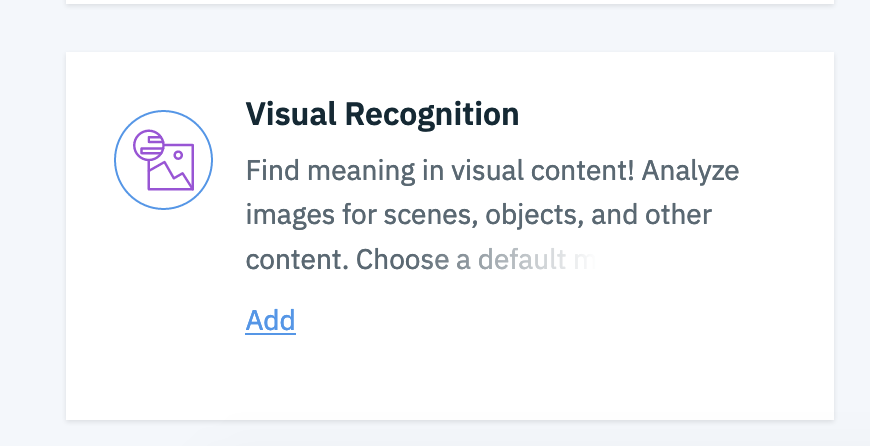

Upon completion you should see the service bound to your project.

  

**Great!** You have created a new machine learning project that you can collaborate on with others, upload data-sets, and create training models. Additionally, this project is now configured to use the Watson
Visual Recognition service that is pre-trained on millions of consumer oriented images and can be used with no additional training (as we'll see below).

However, since consumer data represents only 20% of the world's data, we will create a custom model below to teach Watson your business and what insights are in your images that consumer trained visual recognition software just doesn't cover.

Test the General model
======================

Before creating a custom model, let's check out the **General** model and the **Food** model that IBM has already trained on millions of images.

1. Click the hamburger menu and select **Watson Services**. This will open a list of all the **Watson AI** services that you have instantiated on your IBM Cloud Account. You may only have a few but we'll add more throughtout the labs.
  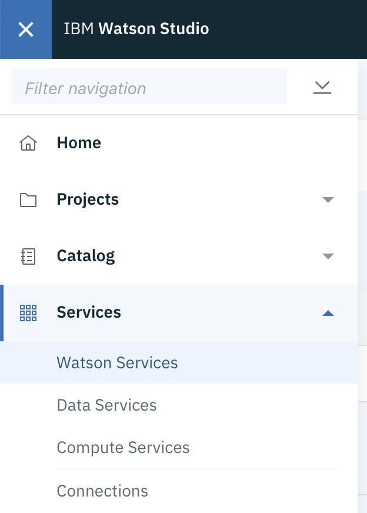
  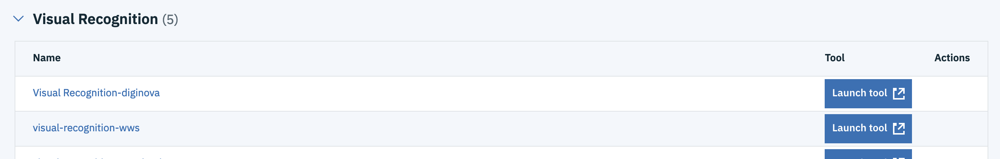

2. Next to your **Watson Visual Recognition Service** click the `Launch Tool`  button. This takes you to the Service page to manage and test the existing models.

    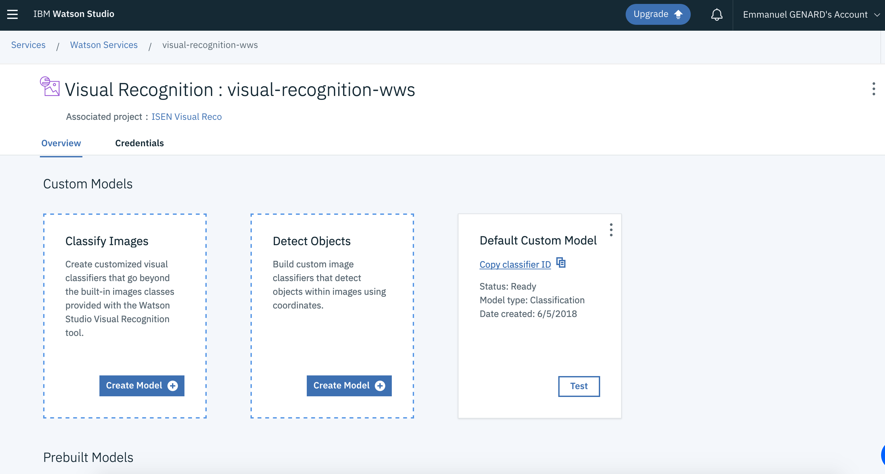

2. Click the **Test** button of the **General** Prebuilt Models panel.

  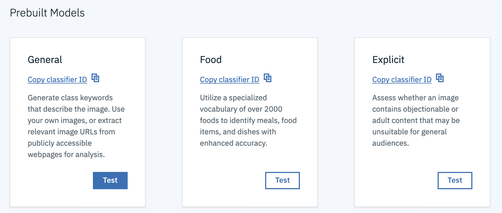

3. Click the **Test** tab of this model to upload an unlabeled image that Watson will examine to determine what insights can be gleaned from Watson's training of millions of images.

    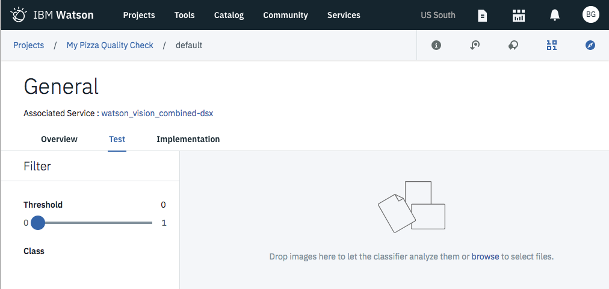

4. Locate your favorite image search tool to find test images, use your personal images or drag images from `Test images` folder

    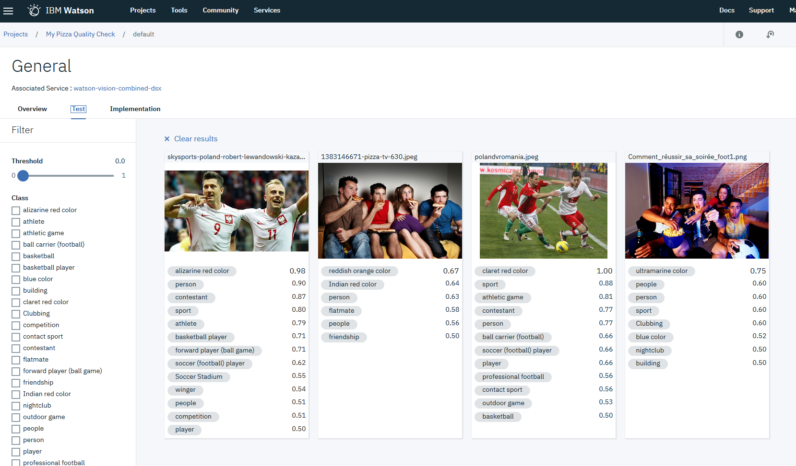

-   Notice it displays the confidence score (which is the statistical probability of this classification against other classifiers in this model).

Now let's explore the Faces model.

1. Click the **watson-vision-combined-dsx** link to return to the model choices.

2. Click the **Test** button of the **Faces** model.

3. Click the **Test** tab of this model then drag images from `Lab1/Lab1 - Test images` folder on the canvas.

   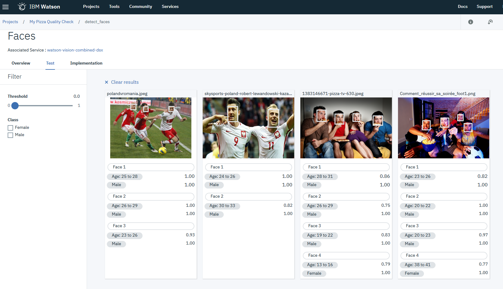

   As you can see, the Faces model not only detect the number of persons, but also the gender and an estimate of the age. It also locates the position of each faces on the picture.

Now let's explore the food model.

5.  Click the **watson-vision-service** (whatever your service name is) link to return to the model choices.
6.  Click the **Test** button of the **Food (Beta)** model.
7.  Click the **Test** tab of this model then  drag images from `Lab1/Lab1 - Test images` folder.

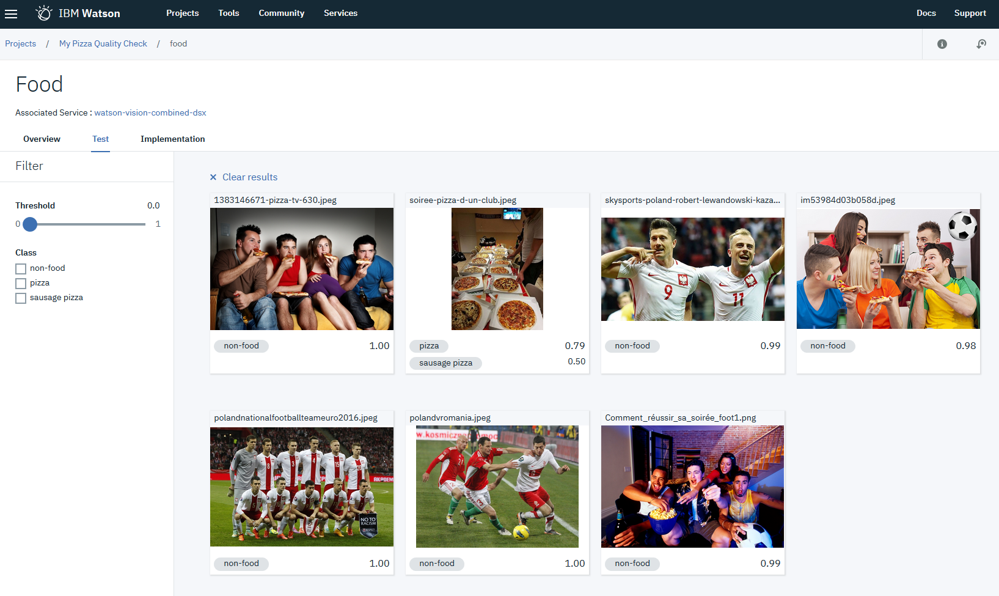

5. You might notice that almost none of the pictures of detected as food. This is because this model is trained to recognize food only when it is the main subject of the picture.

6. Now  drag images from `Crop` folder.

    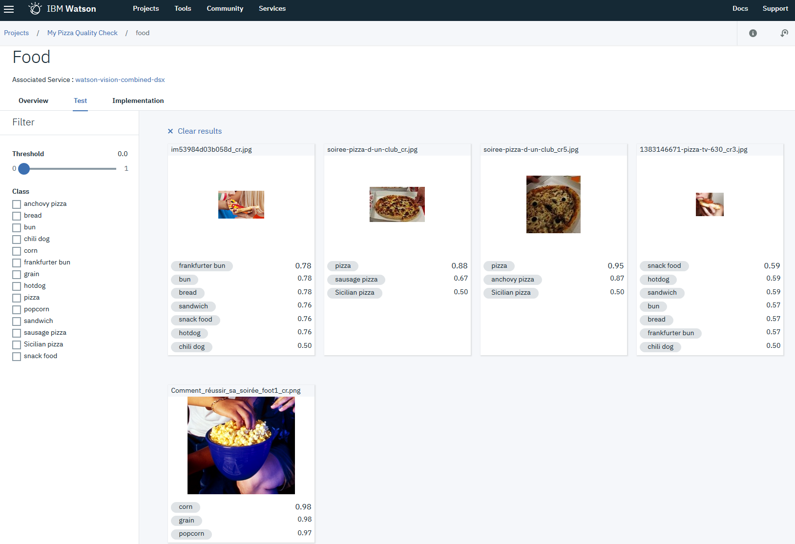

    As can see, it might be useful to divide an image in multiple tiles before querying Visual Recognition service.  As you will see in another lab, it might also be interesting to chain multiple classifier, from a generic one to a specific one to achieve expected results.

    Out of the box, Watson can tell you what kind of objects are in a photo even though these are your private photos that have not been indexed by a search engine nor contain labeled tags that tell Watson what the photo is about -- instead Watson can deduce this by comparing your photo against the millions of labeled photos that Watson has been trained on.

    Yet still, these millions of photos are a drop in the bucket compared to how many photos are in the world and only come from the small 20% of consumer facing data, which leaves 80% of data behind your firewall -- and inside this data is your companies competitive edge.

    Therefore, let's examine how easy it is to teach Watson something that consumer oriented AI doesn't do.

Use Object Detection
====================

Based on the instruction and the product documentation, train a model so that pizzas are recognized and localized on your images.
This is your challenge!!

Documentation to use **Custom Object Detection** is available here: https://cloud.ibm.com/docs/services/visual-recognition?topic=visual-recognition-object-detection-overview
