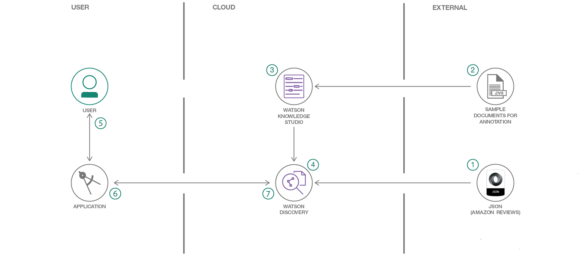
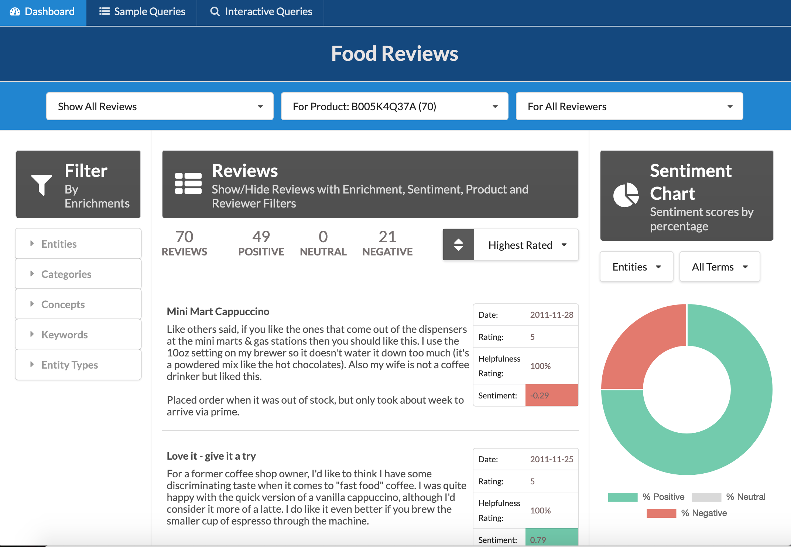

# Natural Language Processing Workshop

This part of the workshop focuses on Natural Language Processing covering various topics:
1. Building a conversational agent (Chatbot) using **IBM Watson Assistant**
2. Discover customer sentiment from product reviews using Natural Language Processing

---

## Building a conversational agent

In this section, you will start using **IBM Watson Assistant** to build a hotel concierge chatbot.
The instructions for the Labs are [here](Lab1V2-Building-a-conversation.pdf)

Artifacts needed across the lab are available [here](artifacts/)

> **Note:** Changes have been made to the user experience of the Watson Assistant service. By default when creating your Watson Assistant service, it will use the new beta user interface which is not aligned with the Lab instructions. **Switch back to the traditional user interface clicking on the pink beta image and follow the instructions to revert to the former UI**

---

## Discover customer sentiment from product reviews using Natural Language Processing

In this section of the workshop, you'll be working with **IBM Watson Discovery** and the web-based tooling to build a custom model for Watson Discovery known as **IBM Watson Knowledge Studio**.

In this lab you'll complete the following tasks:

+ Use Watson Knowledge Studio to create a custom annotator.
+ Deploy a Watson Knowledge Studio model to Watson Discovery.
+ Load and enrich data in the Watson Discovery Service.
+ Query and manipulate data in the Watson Discovery Service.
+ Create UI components to represent enriched data created by the Watson Discovery Service.
+ Build a complete web app that utilizes popular JavaScript technologies to feature Watson Discovery Service data and enrichments.

These tasks are illustrated with the high level architecture below:  

The resulting Web App, either deployed locally or deployed on **IBM Public Cloud** will look as follow:  

The complete instructions to complete the Lab are available [here](https://github.com/IBM/watson-discovery-food-reviews#sample-ui-layout)
